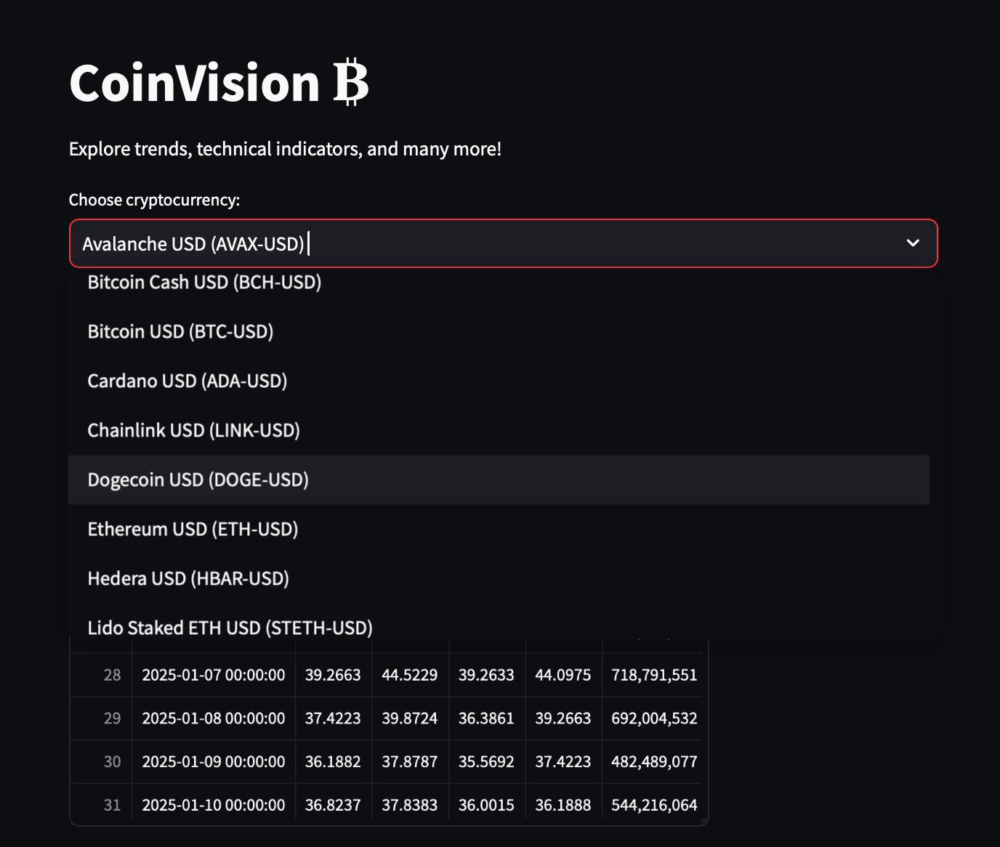
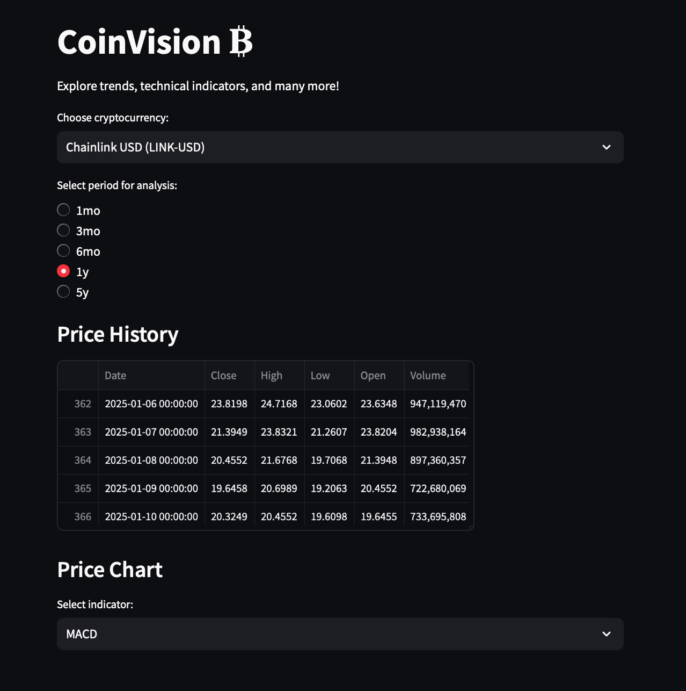
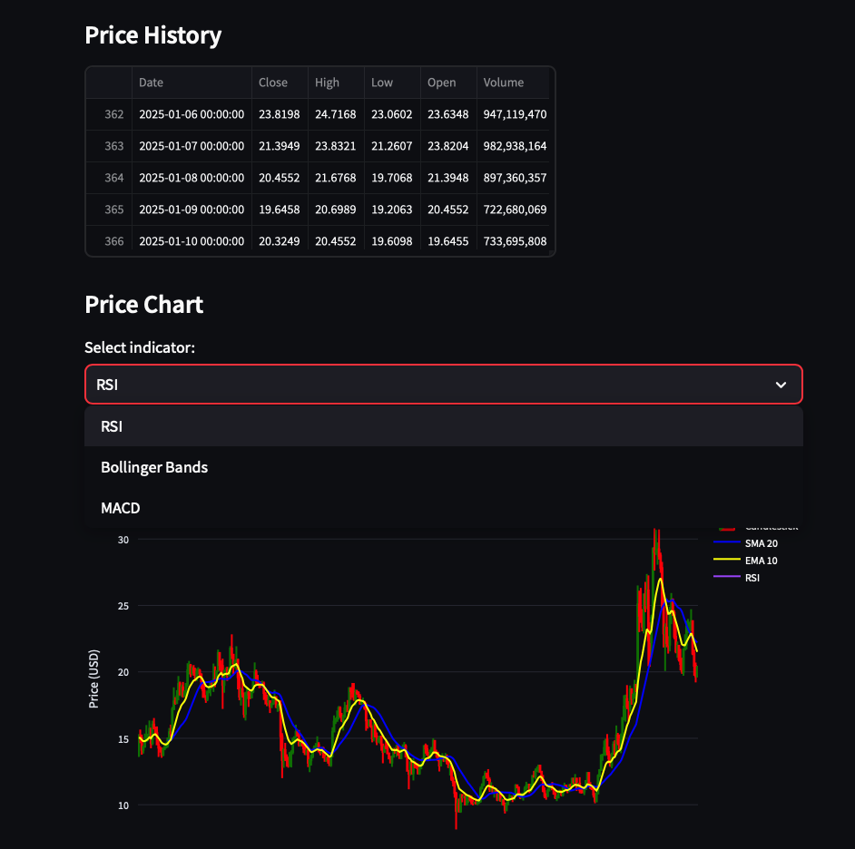
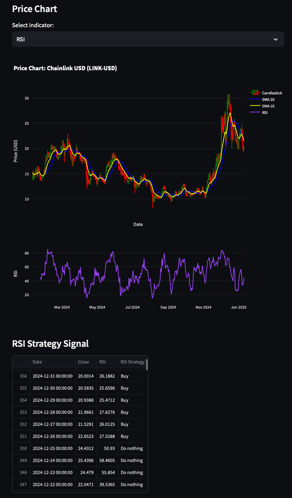
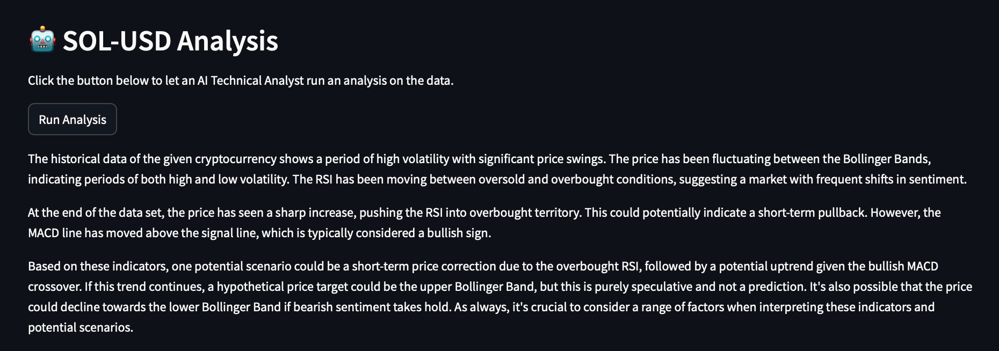

# CoinVision ₿

CoinVision is a Streamlit-based web application that provides real-time cryptocurrency analysis tools with interactive charts and technical indicators. The app allows users to analyze different cryptocurrencies using various technical analysis indicators such as RSI, MACD, and Bollinger Bands.

## Features

- Real-time cryptocurrency data from Yahoo Finance
- Interactive candlestick charts
- Technical indicators:
  - Relative Strength Index (RSI)
  - Moving Average Convergence Divergence (MACD)
  - Bollinger Bands
- Trading signals based on technical indicators
- Multiple timeframe analysis (1 month to 5 years)
- Simple Moving Average (SMA) and Exponential Moving Average (EMA) overlays

## Screenshots
<br>
*Dropdown menu to select different cryptocurrencies*

<br>
*Section where you select the period and see price history*

<br>
*Dropdown menu where you select technical indicators*

<br>
*Screen showing candlestick chart, indicator chart, and indicator strategy*

<br>
*Agent Analysis for SOL-USD*

## Installation

1. Clone the repository:

```
https://github.com/gregorizeidler/crypto_invest_app.git
cd crypto_invest_app
```

2. Create and activate a virtual environment:

### On Windows 
```
python -m venv venv
.venv/Scripts/activate
```

### On MacOS/Linux
```
python3 -m venv venv
source venv/bin/activate
```

3. Install the required dependencies:
```
pip install -r requirements.txt
```

## Usage

1. Start the Streamlit application:
```
streamlit run app.py
```

2. Use the interface to:
   - Select a cryptocurrency from the dropdown menu
   - Choose a time period for analysis
   - Select different technical indicators to display
   - View trading signals based on the selected indicator

## Project Structure
```
crypto_invest_app/
├── app.py                          # Main Streamlit application
├── requirements.txt                # Project dependencies
├── .env.example                    # Example for .env file
└── utils/
    ├── __init__.py                 # Package initialization
    ├── data_extraction.py          # Data retrieval functions
    ├── technical_indicators.py     # Technical analysis calculations
    └── strategies.py               # Trading strategy implementations
    └── gpt_utils.py                # AI Agent implementation
└── data/
    ├── price_history.json          # JSON file containing price and indicator data
```

## Technical Indicators

- **RSI (Relative Strength Index)**: Measures the speed and magnitude of recent price changes to evaluate overbought or oversold conditions.
- **MACD (Moving Average Convergence Divergence)**: Shows the relationship between two moving averages of an asset's price.
- **Bollinger Bands**: Consists of a middle band (SMA) with upper and lower bands that help measure volatility.

## Trading Signals

The application provides trading signals based on common technical analysis strategies:

- **RSI Strategy**: Buy when RSI < 30 (oversold), Sell when RSI > 70 (overbought)
- **MACD Strategy**: Buy when MACD crosses above Signal Line, Sell when MACD crosses below Signal Line
- **Bollinger Bands Strategy**: Buy when price crosses below lower band, Sell when price crosses above upper band

## Dependencies

- streamlit==1.41.1
- yfinance==0.2.51
- pandas==2.2.3
- plotly==5.24.1
- scikit-learn==1.6.0
- statsmodels==0.14.4
- matplotlib==3.9.4
- scipy==1.13.1
- openai==1.59.7

## Authors 
- Gregori Zeidler (<a href="https://github.com/gregorizeidler">@gregorizeidler</a>)
- Luis Fernando Torres (<a href="https://github.com/luuisotorres">@luuisotorres</a>)